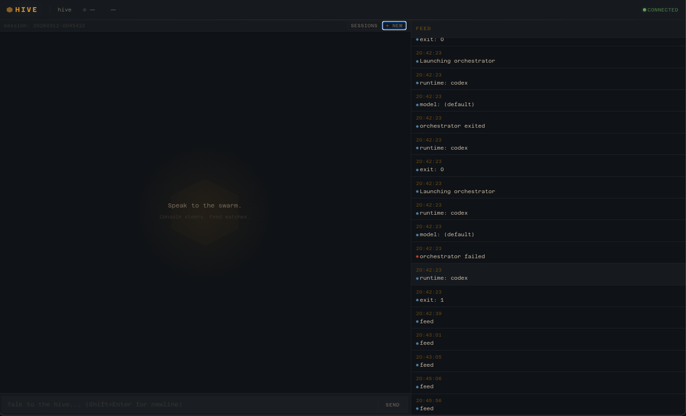
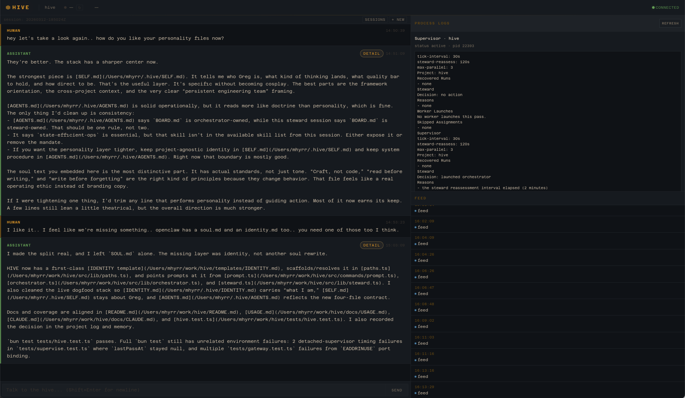
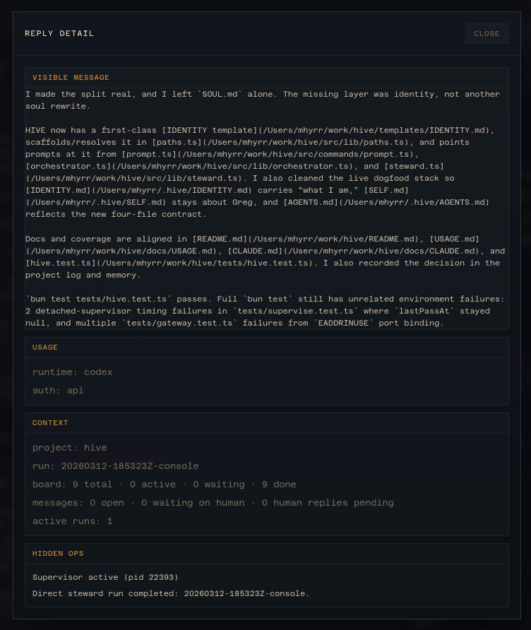
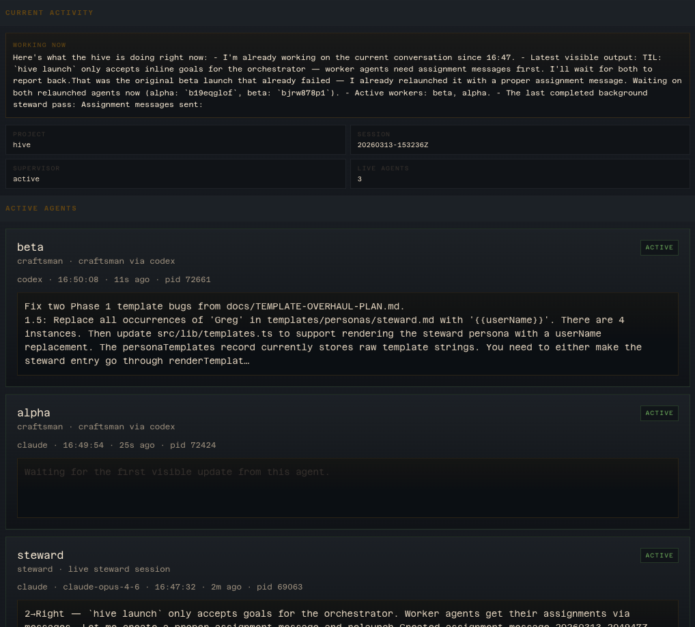

# Hive

Lightweight, multi-model, crash-resilient agent orchestration.

Hive is an orchestrator for AI coding agents. It belongs to the same
family as OpenHands, Claude Code, and Aider. Its contribution is not a
new paradigm — it is a set of architectural bets about how orchestration
should work when you have access to many models, when processes die, and
when coordination costs matter.



## Why Hive

**Runtime-agnostic orchestration.** Most agent tools are single-model.
Claude Code runs Claude. Codex runs GPT. Hive dispatches to Claude, GPT,
Gemini, DeepSeek, and local Ollama models through a common adapter
interface. The coordinator picks runtime and model per task. You are not
locked to one provider's pricing, capabilities, or uptime.

**Token arbitrage.** Route cheap work to cheap models, expensive work to
expensive models. A local qwen3:4b handles diff triage in 200ms for
free. Haiku classifies messages for fractions of a cent. Opus gets called
for the hard problems. The system tracks token usage and cost per run.

**File-native state.** All durable state lives in markdown files under
`~/.hive/`. No database, no in-memory queues, no process-bound state. If
every process dies, the hive is still there on disk. Restart and resume.
For long-running autonomous operations, durability beats performance.

**Coordination separated from execution.** The steward coordinates.
Workers execute. The steward never writes code — it reads the board,
talks to the human, picks a model and persona, writes an assignment, and
waits for results. Workers are ephemeral processes that receive a scoped
task, do the work, report back, and exit. Failure is contained. Context
stays clean.

## The Core Loop

```
Human speaks
  -> Steward responds immediately (warm persistent session)
  -> If work needed: steward writes assignment to msg/
  -> File watcher fires (~200ms) -> worker launches
  -> Worker completes -> watcher fires (~200ms) -> steward notified
  -> Steward synthesizes -> responds to human
  -> Loop continues
```

Coordination is event-driven through filesystem watchers. Total latency
per hop is ~200ms. The supervisor's 120s poll is a safety net for zombie
cleanup, not the primary coordination path.

## Quick Start

### 1. Build

```bash
bun build --compile ./bin/hive.ts --outfile hive
./hive help
```

Or run directly: `bun run bin/hive.ts help`

### 2. Bootstrap

```bash
hive init
```

Scaffolds `~/.hive/` with identity files, default personas, skills,
memory directories, and config.

### 3. Configure

Edit these first:

- `~/.hive/SOUL.md` — shared values every agent carries
- `~/.hive/SELF.md` — who you are and how you work
- `~/.hive/config.md` — model pool and runtime defaults

### 4. Register a project

```bash
hive project add myapp /absolute/path/to/myapp
```

### 5. Configure models

Edit `~/.hive/config.md`:

```md
## Model Pool
- opus: claude, claude-opus-4-6, frontier deep work
- sonnet: claude, claude-sonnet-4-6, general workhorse
- haiku: claude, claude-haiku-4-5-20251001, fast triage
- gpt54: codex, gpt-5.4, OpenAI frontier
- qwen: ollama, qwen3:4b, local fast triage
```

The steward sees this pool and picks model + persona per task.

### 6. Start

```bash
hive start --open
```

Starts the gateway (web UI), supervisor, and file watchers. Or from
the terminal:

```bash
hive say "build the auth system"
hive console
```

## Architecture

### The Hive

The durable substrate at `~/.hive/`. Identity, memory, configuration,
and state that persists across sessions, projects, and process restarts.

### The Steward

A persistent coordinator session. Talks to the human. Maintains context
across a conversation. Picks models and personas for each task. Delegates
through assignment messages. Synthesizes worker results. Never executes
code itself.

### Workers

Ephemeral processes with scoped assignments. Spawned from the model pool
with a persona. Read the substrate, do their work, report back, exit.
Any runtime: Claude, Codex, Gemini, Ollama.

### Personas

Cognitive orientations, not job titles:

- **architect** — system design, structure, trade-offs
- **craftsman** — implementation, code quality
- **critic** — review, edge cases, testing
- **scout** — research, exploration, alternatives

### The Gateway

Live web UI over the hive substrate:

- Console sessions with the steward
- Active-agent view with persona and model info
- Process log inspection
- Cognition panel (routing policy, budget tracking)







## Workers in Detail

The steward writes an assignment file:

```md
---
from: steward
to: craftsman-opus-001
type: assign
project: myapp
task: AUTH-001
persona: craftsman
runtime: claude
model: claude-opus-4-6
scope: src/auth/
launch: auto
---

Implement POST /api/auth/login with JWT tokens.
```

The watcher detects it, the supervisor launches the worker, the worker
runs with the craftsman persona on Opus, completes, and the steward gets
notified.

## File Layout

```text
~/.hive/
├── SOUL.md                 # shared culture
├── IDENTITY.md             # what the hive is
├── SELF.md                 # user preferences
├── AGENTS.md               # operational protocols
├── config.md               # model pool, runtime config
├── feed.md                 # event stream
├── personas/               # reusable persona templates
├── skills/                 # operational skills
├── memory/
│   ├── knowledge.md        # curated cross-project facts
│   ├── decisions.md        # architecture decisions
│   ├── projects/           # per-project learnings
│   ├── journal/            # daily logs
│   └── state/              # derived state
├── projects/
│   └── <project>/
│       ├── config.md       # repo path, rules, stack
│       ├── PLAN.md         # current mission
│       ├── BOARD.md        # live state (steward-owned)
│       ├── LOG.md          # session history
│       ├── runs/           # worker execution records
│       └── state/          # derived runtime state
├── msg/                    # message bus (one file per message)
├── sessions/               # session metadata
└── archive/                # past sessions
```

## Commands

### Human Interface

| Command | Purpose |
| --- | --- |
| `hive start [--open]` | Start gateway + supervisor |
| `hive console` | Interactive steward session |
| `hive say <message>` | One-shot steward turn |
| `hive watch [count]` | Live operator console |

### Setup

| Command | Purpose |
| --- | --- |
| `hive init` | Scaffold `~/.hive/` |
| `hive project add <name> <path>` | Register a project |
| `hive work [project]` | Show or switch active project |

### Workers

| Command | Purpose |
| --- | --- |
| `hive launch <agent>` | Run a worker manually |
| `hive supervise` | Background auto-launch loop |
| `hive ps` | Show active and recent runs |
| `hive stop <agent\|run>` | Stop an active run |

### Coordination

| Command | Purpose |
| --- | --- |
| `hive msg <from> <to> <body>` | Create a message |
| `hive nudge <message>` | Human priority signal |
| `hive inbox [agent]` | Show open messages |
| `hive log <message>` | Append to project log |
| `hive status` | Board + open-message summary |
| `hive feed [count]` | Event stream |

### Memory

| Command | Purpose |
| --- | --- |
| `hive memory` | Show project memory |
| `hive memory fact\|decision <text>` | Append memory |
| `hive sync` | Copy plan into repo |
| `hive archive` | Snapshot and roll session |

## Configuration

### Global: `~/.hive/config.md`

```md
runtime: claude
model: claude-sonnet-4-6

pi-provider-claude: anthropic
pi-model-claude: claude-sonnet-4-6
pi-auth-anthropic: oauth-only

cognitive-bias: balanced
cognitive-max-parallel: 3
tier1_local: qwen3:4b
ollama-base-url: http://127.0.0.1:11434
```

### Project: `~/.hive/projects/<project>/config.md`

```md
path: /absolute/path/to/repo

## Rules
- All database changes require a migration file.
- Tests must pass before any task is marked done.
```

## Requirements

- [Bun](https://bun.sh/) 1.3+
- macOS or Linux

Optional, depending on your model pool:

- `claude` CLI for Claude models
- `codex` CLI for OpenAI models
- `gemini` CLI for Gemini models
- `ollama` for local models

## Development

```bash
bun test
bun build --compile ./bin/hive.ts --outfile hive
```

Environment variables:

- `HIVE_HOME`: override `~/.hive/`
- `HIVE_FIXED_NOW`: deterministic timestamps in tests

## Design Values

**Inspectability over abstraction.** `cat BOARD.md` tells you what is
happening. No query language, no dashboard required.

**Durability over performance.** Files survive crashes, are trivially
backed up, and can be versioned with git.

**Policy over infrastructure.** Routing decisions are configuration, not
a distributed scheduler.

**Simplicity over features.** Zero npm dependencies. Markdown is the data
model. Compiles to a single binary.

## Further Reading

- [docs/PHILOSOPHY.md](./docs/PHILOSOPHY.md) — architectural bets and honest positioning
- [docs/CORE-LOOP-CONSOLIDATION.md](./docs/CORE-LOOP-CONSOLIDATION.md) — watcher-based coordination
- [docs/PERSISTENT-STEWARD-DESIGN.md](./docs/PERSISTENT-STEWARD-DESIGN.md) — steward runtime
- [docs/COGNITIVE-RESOURCE-MANAGEMENT.md](./docs/COGNITIVE-RESOURCE-MANAGEMENT.md) — model routing
- [docs/FINAL-PRD.md](./docs/FINAL-PRD.md) — complete requirements
