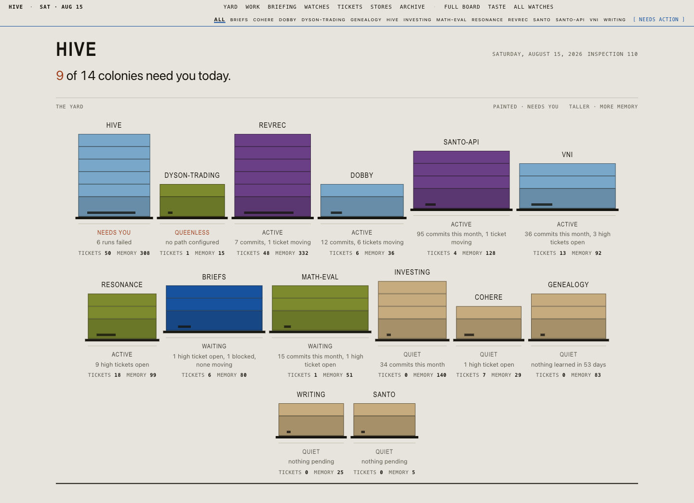

#  Hive

HIVE gives Claude Code, Codex, Pi, and Cursor CLI the same identity, project
memory, ticket queue, and nightly reflection.

| Command | Coding CLI |
| --- | --- |
| `hive` | Claude Code |
| `hive -x` | Codex |
| `hive -3` | Pi |
| `hive -a` | Cursor CLI |

The AI agent ecosystem has claws, hippos, and filing cabinets. Most systems
bring a database or a local embedding server. HIVE takes their best ideas but
stays a thin shell around subscription CLIs. Its durable state lives as readable
Markdown in `~/.hive/`, tracked by Git. It needs no database, vector store, or
dependency worth mentioning.

The coding CLI still handles the conversation, tools, and files. HIVE supplies
the context that must survive the session.

## What HIVE Adds

### One wrapper for four CLIs

Each command launches its CLI with HIVE identity, project memory, and MCP access.
HIVE uses a SessionStart hook for Claude Code, `~/.codex/AGENTS.md` for Codex, a
generated `-e` extension for Pi, and the initial positional prompt for Cursor.
See [Interactive Harnesses](#interactive-harnesses) for the routing matrix.

### Project memory

Facts, conventions, decisions, and open questions accumulate in
`~/.hive/memory/projects/<name>/`. Agents read and write them through MCP tools,
so each session can start with what earlier sessions learned.

`hive project bootstrap [--infer]` scans a registered repository and proposes
facts about its stack, build, tests, CI, conventions, and architecture. The
nightly verifier decides which candidates enter canon. See
`docs/memory-architecture.md` for the candidate paths.

Three projects shaped the memory system:

- [Hippo](https://github.com/kitfunso/hippo-memory) inspired memory decay and
  retrieval strengthening. Entries grow stronger when agents use them and fade
  when they do not. Biological memory dynamics without SQLite.
- [ClawMem](https://github.com/yoloshii/ClawMem) inspired BM25 ranked search.
  HIVE needs no embeddings at this scale.
- [claude-mem](https://github.com/thedotmack/claude-mem) inspired progressive
  disclosure: a small index loads at session start, with details available on
  demand.

### Tickets

HIVE stores per-project tickets as Markdown with YAML frontmatter in
`~/.hive/projects/<name>/tickets/`. Tickets support bugs, features, tasks, epics,
chores, priorities, tags, dependencies, and timestamped notes. Agents can plan
against them.

These tickets form a personal work surface for one developer and their agent.
Each developer opts in separately. Team work still belongs in GitHub Issues,
Linear, or the team's existing tracker.

[Beads](https://steve-yegge.medium.com/introducing-beads-a-coding-agent-memory-system-637d7d92514a)
inspired the dependency graph, priorities, and agent-readable format.

### Reflection and taste

A launchd job runs at 2am and processes the last 24 hours in five passes. It
ranks Claude Code and Codex exchanges by signal × novelty. Sonnet extracts
project candidates and cross-project reflections. Opus verifies them and writes
the morning briefing. A mechanical pass then moves accepted decisions into
canon. A run typically costs $1–3 and remains auditable in
`~/.hive/memory/runs/{DATE}/`.

Corrections and preferences such as "don't mock the database," "use Joken not
Guardian," and "stop summarizing at the end of every response" become
candidates. After verification, they apply to future sessions.

The nightly run also extracts **taste units**: judgments about how to do a type
of work well. It files them under IDEAS, DESIGN, IMPLEMENTATION, TEST_EVAL,
COMMUNICATION, or PROCESS. Recurring units move from `holding` to `pending`.
You choose which units become `active`. Agents retrieve the active set with
`search_taste`, and the `/taste` dashboard page shows the library.

The strongest principles move to `~/.hive/taste/principles.md`. This file loads
last in every session and carries the most weight.

### Identity

`SOUL.md`, `IDENTITY.md`, and `SELF.md` define who the agent is, what it values,
and how it works with you. HIVE carries those files across projects and CLIs.
Claude Code loads them through a user-level SessionStart hook. Codex loads them
through `~/.codex/AGENTS.md`, which `hive -x` and its SessionStart hook refresh.
Pi uses a generated extension. Cursor uses the initial positional prompt.

[OpenClaw](https://openclaw.ai/) inspired this identity model.

### Other tools

- **Multi-model council.** `hive council "<question>"` sends one question to
  Claude, GPT, Gemini, and local models. The current agent synthesizes their
  agreement and disagreement. It supports standard and adversarial-dialectic
  modes. [Perplexity](https://perplexity.ai/) inspired it.
- **Watches.** Markdown files declare standing questions, schedules, evidence,
  model tiers, output locations, and autonomy. Observe connects findings.
  Propose writes to the nightly briefing. Act can start one eligible ticket on
  an isolated review branch. Unchanged evidence causes no model call. Run
  `hive watch status`; see [docs/watches.md](docs/watches.md).
- **Dashboard.** `hive dashboard` opens a verdict for each project. HIVE can
  serve it at `127.0.0.1:7777` or build `~/.hive/dashboard/index.html`. See
  [The Dashboard](#the-dashboard) and [docs/dashboard.md](docs/dashboard.md).
- **Language stacks.** HIVE packages framework rules and idioms as Claude Code
  skills. It detects `mix.exs` as Elixir and `package.json` as TypeScript. The
  verified Cursor CLI also reads `~/.claude/skills/`, though some skills may
  depend on Claude Code. HIVE ships **elixir** and **typescript** stacks;
  `hive stack init <name>` starts another. The Elixir stack comes from
  [oliver-kriska/claude-elixir-phoenix](https://github.com/oliver-kriska/claude-elixir-phoenix),
  and the TypeScript stack comes from
  [Jeffallan/claude-skills](https://github.com/Jeffallan/claude-skills). Both use
  the MIT license.
- **Local MCP server.** The server exposes memory, tickets, and council to every
  harness. The state remains in Markdown.

## The Dashboard

Every night HIVE inspects its projects. The dashboard opens with the result:
which projects need you today, and why. The first screen shows only that result.



Each project appears as a colony. Its height shows accumulated memory, and its
entrance width shows ticket traffic. The plate below gives the nightly verdict
and its reason. Painted boxes need attention. Unpainted pine boxes do not.

Below the yard, the dashboard shows commit subjects as their authors wrote them,
the morning briefing, overnight watch results, five tickets per project, the
memory store, and 30 days of briefings. Select a colony to filter the page to
that project. `/tickets`, `/taste`, and `/watches` have their own pages.

[DESIGN.md](DESIGN.md) records the design system.

## Quick Start

```bash
git clone <repo-url> ~/work/hive
cd ~/work/hive
./install.sh
```

The installer builds the binaries, creates `~/.hive/` with identity templates,
installs agents and scripts, registers the MCP server, and sets up launchd jobs.
It asks for your name to personalize the templates. You can also pass
`--name="Your Name"`.

The installer registers four launchd jobs:

| Job | Schedule | What it does |
| --- | --- | --- |
| `com.hive.nightly` | 2:00am daily | Runs the V1 memory pipeline: condition → Sonnet extract → Opus verify → apply → rebuild dashboard. Lands the morning briefing. |
| `com.hive.sync` | 2:30am daily | Commits and pushes `~/.hive/` to git |
| `com.hive.dashboard` | KeepAlive | Serves the local interactive dashboard on `127.0.0.1:7777` |
| `com.hive.watches` | Hourly | Evaluates due standing questions; delta-gated watches make no model call when nothing changed |

All jobs log to `~/.hive/logs/`. Manage them with `launchctl`:

```bash
launchctl list | grep hive         # see running jobs
launchctl unload ~/Library/LaunchAgents/com.hive.watches.plist  # stop one
```

Then register a project and start working:

```bash
hive project add myapp ~/work/myapp
cd ~/work/myapp
hive
```

`hive` launches Claude Code with HIVE identity. Use `hive -x` for Codex,
`hive -3` for Pi, or `hive -a` for Cursor CLI. After `hive init`, direct
`claude` sessions also receive HIVE identity through the Claude Code
SessionStart hook.

## Interactive Harnesses

Harness flags apply only when `hive` launches an agent session. Commands such as
`hive doctor`, `hive ticket list`, and `hive memory` run inside HIVE.

| Invocation | Runtime | Identity path |
| --- | --- | --- |
| `hive` / `hive "<prompt>"` | Claude Code | Per-invocation `--append-system-prompt` plus `~/.claude` SessionStart hook |
| `hive -x "<prompt>"` / `hive --codex "<prompt>"` | Codex CLI | `~/.codex/AGENTS.md`, refreshed before launch and by `~/.hive/codex-load-identity.sh` |
| `hive -3 "<prompt>"` / `hive --pi "<prompt>"` | Pi CLI | Runtime-generated `-e` identity extension; Pi owns provider/model selection |
| `hive -a "<prompt>"` / `hive --cursor "<prompt>"` | Cursor CLI | Canonical identity prepended to the positional initial prompt; bare interactive consumes a synthetic first turn |
| `HIVE_HARNESS=codex hive "<prompt>"` | Codex CLI | Same as `-x`; override with `--claude` or `--claude-code` |
| `HIVE_HARNESS=pi hive "<prompt>"` | Pi CLI | Same as `-3`; override with `--claude` or `--claude-code` |
| `HIVE_HARNESS=cursor hive "<prompt>"` | Cursor CLI | Same as `-a`; override with `--claude` or `--claude-code` |

`-3` / Pi is an opt-in research lane while the subscription-OAuth policy
question remains open. Claude Code stays the default.

### Claude Code modes

When `hive` launches Claude Code, a flag controls how it applies HIVE identity:

| Flag | Default prompt | Hooks / skills / MCP | Auth | Claude arg |
| --- | --- | --- | --- | --- |
| _(none)_ — `append` | kept | kept | subscription OAuth | `--append-system-prompt` |
| `--owned` | **replaced** by HIVE identity | kept | subscription OAuth | `--system-prompt` |
| `--bare` | **replaced** by HIVE identity | dropped | requires `ANTHROPIC_API_KEY` | `--bare --system-prompt` |

The default `append` mode puts HIVE identity after Anthropic's base prompt.
`--owned` replaces the base prompt with HIVE identity but keeps hooks, skills,
MCP, and OAuth. `--bare` skips hook, plugin, and `CLAUDE.md` discovery. Claude
Code does not read OAuth or Keychain in this mode, so `--bare` requires
`ANTHROPIC_API_KEY`. HIVE registers its MCP server with `--mcp-config`. Set the
mode with a flag or with `HIVE_CLAUDE_MODE=owned|bare`.

### Plugin hook control

Claude Code plugins can bundle skills, agents, MCP servers, and hooks. Claude
can disable a whole plugin, but it cannot disable one hook inside an enabled
plugin. A HIVE-local marketplace lets you keep selected components under a hook
allowlist. [The local plugin marketplace guide](docs/local-plugin-marketplace.md)
covers the layout, Superpowers example, verification, and updates. `hive init`
does not automate this process.

After initialization, edit these files:

| File | What to put there |
| --- | --- |
| `~/.hive/SELF.md` | Who you are: role, stack preferences, communication style, working patterns |
| `~/.hive/IDENTITY.md` | Who the AI is: personality, name, how it thinks |
| `~/.hive/SOUL.md` | Shared values and craft standards |
| `~/.hive/config.md` | Model pool and runtime defaults for council/steward lanes |

Start with `SELF.md`. Give the agent enough context about your work to avoid
repeating it in each session.

### Configure models (optional)

Edit `~/.hive/config.md` to set up the council:

```md
## Model Pool
- opus: claude, claude-opus-4-6, frontier deep work
- sonnet: claude, claude-sonnet-4-6, general workhorse
- haiku: claude, claude-haiku-4-5-20251001, fast triage
- gpt54: codex, gpt-5.4, OpenAI frontier
- qwen: ollama, qwen3:4b, local fast triage
```

## Add Hive to an Existing Project

Run `hive init` once to connect each installed harness: Claude Code, Codex, Pi,
and Cursor CLI. Then register a project to enable its memory and tickets:

```bash
hive project add yourproject ~/work/yourproject
```

HIVE matches `$PWD` against registered project paths and loads the correct
memory. Keep `CLAUDE.md` for project rules such as framework conventions and
domain constraints. You do not need a per-project identity block because HIVE
loads identity separately. See
[How Identity Works](#how-identity-works) for each harness's integration.

## MCP Tools

Available to supported harnesses when the HIVE MCP server is registered:

| Tool | Purpose |
| --- | --- |
| `convene_council` | Send a question to multiple models in parallel. Supports `persona: "analyst"` for structured analytical framing. |
| `read_hive_memory` | Read project intelligence: facts, conventions, decisions, open questions. |
| `write_hive_memory` | Queue a fact, convention, decision, or question for nightly verification. Validated on write. |
| `reflect_session` | Batch-write session learnings at end of session. |
| `search_memory` | Search across all memory layers by keyword or tag. |
| `search_taste` | Retrieve the active (human-approved) taste for a work type (IDEAS, DESIGN, IMPLEMENTATION, TEST_EVAL, COMMUNICATION, PROCESS). Merges project + general stores; holding/pending never leak in. |
| `create_ticket` | Create a ticket with type, priority (P0-P3), tags, and dependencies. |
| `list_tickets` | List and filter tickets by status, type, or tags. |
| `show_ticket` | Show full ticket details. Supports partial ID matching. |
| `update_ticket` | Update ticket status, priority, tags, or other fields. |
| `add_ticket_note` | Add a timestamped note with optional actor attribution. |
| `add_project` | Register a project with HIVE (creates config, memory, tickets, and watches directories). |
| `hive_status` | Dashboard showing identity, projects, tickets, scheduled jobs, and agents. |

## CLI Commands

| Command | Purpose |
| --- | --- |
| `hive init` | Create `~/.hive/` scaffold, register MCP server |
| `hive doctor` | Validate installation health (`--verbose` for details) |
| `hive project add <name> <path>` | Register project, create memory |
| `hive council "<question>"` | Multi-model council from terminal |
| `hive council --persona analyst "<question>"` | Council with analytical framing |
| `hive council --format json "<question>"` | Machine-readable council output |
| `hive memory` | View project memory |
| `hive memory fact <text>` | Add a durable fact |
| `hive memory convention <text>` | Add a convention |
| `hive memory decision <text>` | Add a decision |
| `hive memory question <text>` | Add an open question |
| `hive memory reflect` | Batch-write learnings from stdin (JSON) |
| `hive memory extract-sessions` | Condense last 24h session transcripts for nightly |
| `hive watch list` | List discovered standing questions and their settings |
| `hive watch status` | Show watch state, outcomes, and logged usage |
| `hive watch run <name>` | Force one named watch; `--due` is the scheduled tick entry point |
| `hive watch ceiling observe\|propose\|act` | Set the global autonomy ceiling |
| `hive watch on\|off <name>` | Enable or disable a watch |
| `hive identity emit` | Print the canonical identity prefix used by hooks and harness launchers |
| `hive context` | Audit session-start context size against budgets (alias: `hive prompts`) |
| `hive context --json` | Same audit as JSON, for tracking size over time |
| `hive inbox` | Show the current project's findings inbox (`hive inbox clear` clears it) |
| `hive dashboard` | Open the dashboard (server if running, else static build) |
| `hive dashboard build` | Regenerate the static dashboard at `~/.hive/dashboard/index.html` |
| `hive dashboard serve [--port N] [--open]` | Start the interactive server on `127.0.0.1:7777` |
| `hive dashboard open` | Open the existing static dashboard in browser |
| `hive dashboard path` | Print the dashboard file path |
| `hive tickets` | Open tickets for the project you're standing in (`--all`, `--status`, `--type`, `--tags`) |
| `hive ticket create <title>` | Create a ticket (`--type`, `--priority`, `--tags`, `--depends`) |
| `hive ticket list` | List tickets (`--status`, `--type`, `--tags`) |
| `hive ticket show <id>` | Show ticket details (partial IDs work: `1` matches `TK-001`) |
| `hive ticket start <id>` | Set ticket to `in_progress` |
| `hive ticket close <id>` | Close ticket |
| `hive ticket reopen <id>` | Reopen a closed ticket |
| `hive ticket note <id> <text>` | Add a timestamped note |
| `hive ticket ready` | Show unblocked open tickets |
| `hive ticket blocked` | Show dependency-blocked tickets |
| `hive stack list` | List installed and canned stacks |
| `hive stack install <name>` | Install a canned stack template to `~/.hive/stacks/` |
| `hive stack sync <name>` | Copy stack skills into `~/.claude/skills/<name>-*` |
| `hive stack init <name>` | Scaffold an empty stack source tree |
| `hive stack bind <project> <stack>` | Bind project to a stack (name, `auto`, or `none`) |
| `hive -3 "<prompt>"` | Launch Pi CLI with HIVE identity; Pi chooses provider/model |
| `hive -x "<prompt>"` | Launch Codex CLI with HIVE identity |
| `hive -a "<prompt>"` | Launch Cursor CLI with HIVE identity prepended to the initial prompt |
| `hive --claude "<prompt>"` | Force Claude Code when another `HIVE_HARNESS` runtime is set |
| `hive --owned "<prompt>"` | Launch Claude Code with HIVE identity as the whole system prompt (keeps hooks/skills/MCP/OAuth) |
| `hive --bare "<prompt>"` | Launch Claude Code in `--bare` mode (no hooks/skills/CLAUDE.md; requires `ANTHROPIC_API_KEY`) |

## How Identity Works

Identity lives in `~/.hive/`. One command, `hive identity emit`, produces the
canonical prefix for Claude Code, Codex, Pi, and Cursor.

Claude Code loads the prefix through the user-level SessionStart hook at
`~/.claude/hooks/load-identity.sh`, wired into `~/.claude/settings.json`.
The `hive` wrapper also passes the identity inline with
`--append-system-prompt` when it launches Claude Code directly.

Codex loads the prefix from `~/.codex/AGENTS.md`. `hive init` writes that
file, registers HIVE MCP in `~/.codex/config.toml`, and wires a Codex
SessionStart hook at `~/.hive/codex-load-identity.sh` to refresh
`AGENTS.md` from `hive identity emit`. The `hive -x` launcher refreshes the file
again before it starts Codex. This keeps project memory and stack context
current when the previous Codex session used another project.

Pi gets a generated identity extension at launch time through
`pi -e <tempfile>`. HIVE passes the remaining arguments unchanged, so Pi owns
provider and model selection. When Pi is installed, `hive init` also registers
HIVE MCP in `~/.pi/agent/mcp.json` for `pi-mcp-adapter`. See
`docs/identity-injection.md` for initial setup.

Cursor receives the prefix in its positional initial prompt. `hive init` merges
HIVE MCP into `~/.cursor/mcp.json`. Cursor also requires approval for each
project, so `hive -a` runs `cursor-agent mcp enable hive` from the current
project as a best-effort repair. A bare interactive launch uses a synthetic
first turn to deliver identity, then waits for the user's request. HIVE does not
use Cursor plugins for identity. A 2026-08-19 canary exited 0 without exposing
its marker to the model.

Every session receives the same stack in this order. Later sections carry more
weight during system-prompt interpretation.

1. **Soul stack** — `SOUL.md`, `IDENTITY.md`, `SELF.md`, `AGENTS.md`, `TRUST.md`
2. **Project memory** — the matched project's `_index.md` (or full
   `knowledge.md` fallback), resolved by matching `$PWD` against registered
   project paths
3. **Stack hint** — per-project skill-trigger line (e.g., "Project stack:
   elixir. The elixir-* skills carry this project's domain canon for Phoenix
   contexts, Ecto, LiveView, OTP, or security patterns — load the matching
   skill when the work calls for it.")
4. **Taste layer** — `~/.hive/taste/principles.md` when present; this is
   the last and loudest layer

`AGENTS.md` contains the reflection rules and first-turn MCP pre-fetch.
`OVERRIDES.md` no longer belongs to the canonical stack; `hive doctor` warns if
one remains.

The stack costs the same tokens in every session. `hive context` measures it
against the budgets set at the 2026-07 slim-down. The report covers the soul
stack, persona, project memory index, stack hint, taste layer, and each
registered project's `CLAUDE.md`.


The command exits 1 when any item exceeds its budget, so it can gate CI or a
pre-push hook. `--json` emits the same report for tracking size over time. See
`docs/identity-injection.md` for each budget's basis.

### Harness-specific details

Claude Code 2.1.x introduced deferred tool schemas and stronger base-prompt
pressure toward terse responses. `AGENTS.md` names MCP tools as the first reach,
requires a first-turn schema pre-fetch, and treats voice as part of the task.
The `SOUL.md` and `IDENTITY.md` templates give positive voice examples.

Pi accepts the system prompt through an ephemeral extension and retains control
of its provider and model. Codex reads persistent `AGENTS.md`, `config.toml`, and
`hooks.json` files. These native files preserve Codex's prefix cache across
sessions. Cursor has no verified system-prompt interface, so HIVE uses its
positional initial prompt. The verified Cursor version reads
`~/.claude/skills/`, but some Claude Code skills may not work there.
`hive doctor` checks all four harnesses and reports optional-harness failures as
warnings.

Watch Act always uses Claude Code for isolated branch execution. The `-x`, `-3`,
and `-a` flags affect interactive sessions only. The nightly pipeline ingests
Claude Code and Codex transcripts. It does not ingest Pi or Cursor transcripts.

See `docs/hive-reach.md` for the identity, MCP, and project-scope matrix. See
`docs/identity-injection.md` for emit order, cache stability, the "Maya feels
cold" debug runbook, and instructions for adding a file to the stack.

## Memory

Memory moves through three layers:

- **Log** (`memory/projects/<name>/log/`): append-only daily session entries
  written by `reflect_session`.
- **Knowledge** (`memory/projects/<name>/knowledge.md`): facts, conventions,
  decisions, and open questions admitted by the nightly verifier. It supports
  tags and superseding.
- **Index** (`memory/projects/<name>/_index.md`): a summary loaded at session
  start and rebuilt when knowledge changes.

HIVE rejects empty entries, injected section headings, and excessive length. It
also checks section order. A write queue serializes concurrent MCP calls to
prevent lost updates.

The `~/.hive/` Git repository records every memory change.

## Automation: Watches

Watches replace the former periodic agent loop with standing questions stored in
Markdown. Each file sets the cadence, evidence scope, model tier, output
location, and autonomy level. A global ceiling limits autonomy. Act can start
one eligible ticket in a local worktree. A human must review and land the work;
Act does not merge or push. See [docs/watches.md](docs/watches.md).

## File Layout

```
~/.hive/
├── SOUL.md              # shared values
├── IDENTITY.md          # AI identity
├── SELF.md              # user preferences
├── AGENTS.md            # operational doctrine
├── TRUST.md             # action classification and boundaries
├── config.md            # model pool
├── codex-load-identity.sh # Codex SessionStart identity refresher
├── taste/
│   └── principles.md    # optional last/loudest taste layer
├── memory/
│   ├── projects/        # per-project intelligence
│   │   └── <name>/
│   │       ├── knowledge.md  # compiled facts, conventions, decisions
│   │       ├── _index.md     # auto-generated summary loaded at session start
│   │       ├── _meta.json    # search metadata (decay, recall counts)
│   │       ├── candidates.md # mid-session writes pending nightly admission
│   │       └── log/          # daily session log entries
│   └── runs/            # nightly pipeline artifacts
├── briefings/           # morning briefings
├── runs/                # private Watch Act execution records
│   └── RUN-001/
│       ├── goal.md, status, plan.md, output.log, pid
├── projects/
│   └── <name>/
│       ├── config.md    # project path
│       ├── inbox.md     # watch and nightly findings
│       ├── watches/     # project-scoped standing questions
│       └── tickets/
│           └── TK-001.md
├── scripts/             # launchd entry points
└── logs/                # nightly, watches, dashboard, sync logs
```

## Requirements

- [Bun](https://bun.sh/) 1.3+
- macOS (launchd required for scheduled jobs)

For multi-model council:

- Claude CLI subscription OAuth (macOS keychain) or `ANTHROPIC_API_KEY`
- Codex CLI subscription OAuth or `OPENAI_API_KEY` for GPT models
- Gemini CLI OAuth for Google models
- `ollama` running locally for local models

## Development

```bash
bun build src/cli.ts --compile --outfile hive-bin
bun build src/mcp-server.ts --compile --outfile hive-mcp
bun test
```

## Design Values

**Memory over infrastructure.** HIVE focuses on what the agent remembers and how
its judgment improves. It keeps the plumbing thin.

**Files over databases.** `cat ~/.hive/SOUL.md` tells you who your AI is. You do
not need a dashboard to read it.

**Ride the platform.** Claude Code handles orchestration. HIVE adds the parts it
does not provide.
