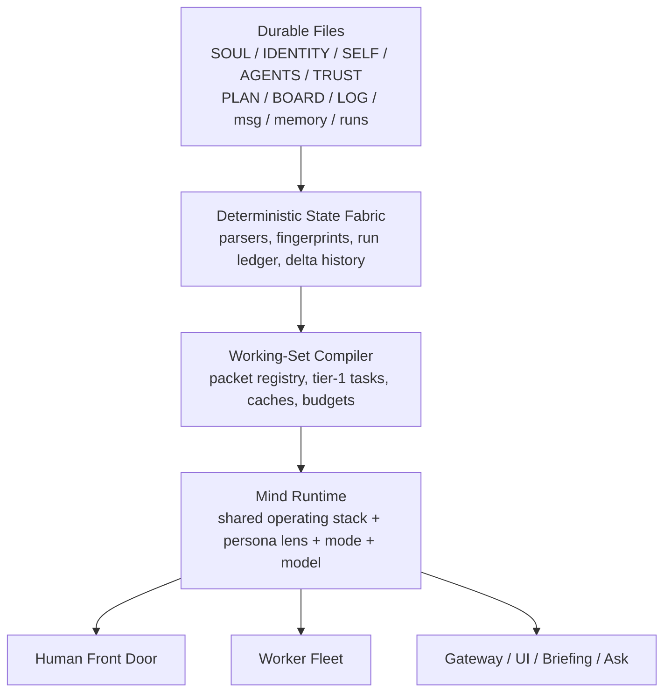

# HIVE Compiled Multi-Mind Architecture

Design document. March 2026.

Depends on:
- [HIVE Persona Theory](./HIVE-PERSONA-THEORY.md)
- [HIVE Cognitive Resource Management](./COGNITIVE-RESOURCE-MANAGEMENT.md)
- [HIVE Memory Architecture](./HIVE-MEMORY-ARCHITECTURE.md)
- [HIVE Persistent Steward Design](./PERSISTENT-STEWARD-DESIGN.md)

---

## 1. Purpose

HIVE is already close to the right shape:

- the file substrate is durable and inspectable
- the steward is becoming persistent
- cognitive routing exists
- personas are defined as lenses, not fake org-chart roles
- tier-1 compression is real

But the system is still asymmetrical in two important ways:

1. **Coordination is too concentrated in one file and one seat.**
   The persistent steward is carrying tools, runtime resolution, prompt
   construction, and turn lifecycle all at once. More importantly, the
   *ability to coordinate* still feels like a special property of "the
   steward" rather than a shared capability of the hive.

2. **Compaction is still bespoke.**
   HIVE has three tier-1 consumers today:
   front-door preprocessing, completed-worker compression, and diff triage.
   They work, but they are still implemented as individual features, not as a
   reusable substrate for compiling attention.

This document defines the next architecture:

- one shared soul and identity
- many minds, on many models
- the same coordination protocol everywhere
- compiled working sets instead of repeated prompt assembly
- explicit authority and delegation
- maximized useful tokens per second and per dollar

The goal is not "a better steward." The goal is a **true multi-mind HIVE**
where any suitable model can participate in coordination under the same
operating contract, while the system stays file-native, inspectable, and
cheap enough to run continuously.

---

## 2. Product Goal

The user should be able to ask HIVE for anything from "what changed?" to
"design and ship this subsystem," and the system should:

1. choose the right mix of models and personas
2. keep all of them grounded in the same soul, identity, and project truth
3. avoid spending expensive tokens on repeated state hydration
4. let multiple minds coordinate without splitting into contradictory selves
5. preserve durable decisions in files, not in hidden chat state

Put differently:

**HIVE should feel like one organism with many minds, not many bots wearing
different costumes.**

---

## 3. Design Principles

### 3.1 One Soul, Many Minds

Every HIVE mind shares the same operating stack:

- `SOUL.md`
- `IDENTITY.md`
- `SELF.md`
- `AGENTS.md`
- `TRUST.md`
- the current project's files and derived state
- the same tool contract
- the same coordination protocol

Personas are overlays, not separate identities.

The architect, critic, craftsman, scout, and steward are not different beings.
They are different attentional stances applied by the same hive.

### 3.2 Coordination Is a Protocol, Not a Personality

The current system risks making coordination feel like something only the
steward can do because it has the "orchestrator prompt." That is too fragile.

Coordination should instead come from:

- shared packet formats
- shared tool affordances
- explicit authority rules
- deterministic state and derived summaries
- repeatable handoff and arbitration mechanics

Any mind can coordinate if it has:

- the right working set
- the right tool permissions
- a valid coordination lease for the scope in question

### 3.3 Compile Attention Before Spending Reasoning

Raw files are source material, not prompt cargo.

The system should compile compact, reusable attention artifacts from:

- board state
- messages
- run results
- diffs
- logs
- journal slices
- memory files
- session history

The expensive model should consume compiled state first and raw state only on
demand.

### 3.4 Spend the Cheapest Sufficient Tokens

HIVE does not maximize intelligence in the abstract. It maximizes
**useful work per token budget**.

That means:

- deterministic first
- small/local models second
- strong worker models third
- frontier synthesis last

The right question is not "which model is smartest?" It is "what is the
cheapest lane that changes the decision?"

### 3.5 Compile Once, Consume Many

If five consumers need to know that a worker finished successfully and touched
three files, HIVE should not pay five times to rediscover it.

Derived context artifacts should be:

- fingerprinted
- cacheable
- reusable across steward, workers, front door, and UI

### 3.6 Durable Truth Lives on Disk

No matter how many active minds are running:

- files remain source of truth
- derived state remains disposable
- session state remains reconstructable

This architecture strengthens the file substrate. It does not replace it with
opaque runtime memory.

---

## 4. Core Concepts

### 4.1 Operating Stack

The invariant base context every HIVE mind inherits:

- culture: `SOUL.md`
- hive self-concept: `IDENTITY.md`
- user preferences: `SELF.md`
- operating doctrine: `AGENTS.md`
- trust and authority policy: `TRUST.md`
- coordination protocol
- tool policy

This is the part that should be truly shared.

### 4.2 Persona Lens

A persona is a cognitive lens:

- steward: coordination and integration
- architect: boundaries and structure
- craftsman: implementation quality and fit
- critic: failure modes and review
- scout: terrain, options, precedent

The persona changes attention, not identity.

### 4.3 Mind Seat

A **mind seat** is an active or activatable binding of:

- the operating stack
- a persona lens
- a mode
- a runtime/model
- a scope
- a working set
- a tool policy
- an authority envelope

A seat may be:

- cold: described in config, no live session
- warm: recent compiled context, no active turn
- hot: live session with stateful context

Example seats:

- `steward-primary`
- `architect-structural-review`
- `critic-security-pass`
- `craftsman-implementation-alpha`
- `scout-research-brief`

### 4.4 Mode

Mode is separate from persona.

Suggested base modes:

- `control`: coordination, assignment, arbitration
- `synthesis`: integration, briefing, user-facing explanation
- `build`: implementation and execution
- `review`: critique and risk discovery
- `research`: exploration and external comparison
- `compress`: compaction, summarization, packet generation

This matters because the same persona may need different operating behavior.
A steward in `control` mode and a steward in `synthesis` mode are not doing the
same work, even on the same model.

### 4.5 Working-Set Packet

A **working-set packet** is the core derived artifact of the next system.

It is a compact, typed, fingerprinted unit of attention.

Example packet kinds:

- `human-request`
- `board-health`
- `open-decisions`
- `run-result`
- `run-diff-triage`
- `log-rollup`
- `phase-summary`
- `memory-hotset`
- `stale-memory-candidates`
- `session-brief`
- `worker-assignment-brief`
- `approval-queue`

Packets are produced by deterministic logic or tier-1 cognition and then
consumed by multiple minds.

### 4.6 Working Set

A **working set** is the current curated collection of packets relevant to a
seat or turn.

The working set is what a seat should see first.

Raw files remain available, but the working set is the compiled default view.

### 4.7 Coordination Lease

A **coordination lease** is the mechanism that makes "all minds can coordinate"
safe instead of chaotic.

A lease grants a seat scoped temporary authority over a mission or slice of
state:

- scope roots
- task or board items
- allowed tools
- allowed write targets
- expiry or heartbeat
- escalation rules

Examples:

- A craftsman seat gets a lease to coordinate sub-steps inside one assignment.
- A critic seat gets a lease to request fixes or open review messages.
- An architect seat gets a lease to split a migration into work packets.
- The steward has the broadest default lease for cross-project arbitration.

Authority becomes explicit and inspectable instead of being smuggled through
prompt wording.

---

## 5. The Target Architecture



### Layer 0: Durable Source Substrate

No change:

- markdown files
- frontmatter
- runs
- messages
- journals
- memory summaries

This stays inspectable and versionable.

### Layer 1: Deterministic State Fabric

This extends what already exists in `src/lib/state.ts`.

Responsibilities:

- parse project state
- compute fingerprints
- detect revisions
- summarize open messages, active runs, recent results
- maintain delta history
- expose cheap facts for routing

This layer should do as much as possible without a model.

### Layer 2: Working-Set Compiler

This is the new system.

Responsibilities:

- register compile tasks
- decide deterministic vs tier-1 path
- cache packets by source fingerprint
- enforce budget and freshness policy
- support event-driven and idle compilation
- bound concurrency
- materialize packet files and aggregate working sets

This is where compaction becomes a platform instead of a helper function.

### Layer 3: Mind Runtime

This generalizes the persistent steward idea.

Responsibilities:

- host hot and warm mind seats
- bind persona + mode + model + tool policy
- receive working sets
- converse, assign, review, synthesize
- persist durable decisions back to files

The persistent steward becomes the first instance of this layer, not the only
instance.

### Layer 4: Execution Fleet

Workers remain disposable, but their prompts and control loop become consumers
of compiled working sets rather than raw prompt assembly.

### Layer 5: Human Interface

The user still talks to one HIVE.

Internally, the front door may:

- answer from a tier-1 packet
- route to a hot steward seat
- invoke a specific seat
- launch a short-lived task pod

But the external experience stays coherent.

---

## 6. Working-Set Compiler

### 6.1 Why This Is the Next Primitive

HIVE currently has the right instincts but the wrong granularity.

Today:

- diff triage is one function
- completed-run compression is one function
- message preprocessing is one function

Tomorrow:

- all three are compile tasks in one engine
- idle log rollup is another task
- stale-memory detection is another task
- worker assignment briefing is another task
- session bootstrap packetization is another task

The engine is the important thing, not any one task.

### 6.2 Packet Shape

Suggested canonical shape:

```ts
type WorkingSetPacket = {
  packetId: string;
  kind: string;
  projectId: string;
  scope: string[] | null;
  producedAt: string;
  expiresAt: string | null;
  sourceFingerprints: Record<string, string>;
  producer: {
    tier: 0 | 1 | 2 | 3;
    lane: "deterministic" | "local" | "cloud" | "worker" | "steward";
    provider: string | null;
    model: string | null;
  };
  priority: "low" | "normal" | "high" | "critical";
  audience: string[];
  summary: string;
  details: Record<string, unknown>;
  evidence: {
    path: string;
    kind: "file" | "run" | "message" | "state";
    note: string | null;
  }[];
  tokenStats: {
    estimatedRawTokens: number | null;
    compiledTokens: number | null;
    estimatedSavings: number | null;
  };
};
```

This gives HIVE something it currently lacks:

- a reusable attention unit
- provenance
- freshness
- token economics
- audience targeting

### 6.3 Compile Modes

The compiler should support three modes.

#### Event Compile

Triggered by a specific change:

- new human message
- worker completed
- new diff
- board changed
- approval requested

Used for:

- front-door preprocessing
- run compression
- diff triage
- worker assignment briefing

#### Turn-Start Compile

Triggered when a seat is about to reason.

Used for:

- steward refresh packet
- human question packet
- active project session brief
- current blockers packet

#### Idle Compile

Triggered only when:

- no human turn is active
- no critical work is waiting
- budget allows background cognition

Used for:

- log rollup
- completed phase summaries
- stale memory candidate detection
- memory hotset refresh
- journal-to-entity promotion candidates

### 6.4 Task Registry

The workbench should not be a giant switch statement.

Each compile task should declare:

- `id`
- `kind`
- `trigger`
- `priority`
- `audience`
- `input fingerprints`
- `freshness TTL`
- `deterministic gate`
- `runner`

Suggested shape:

```ts
type CompilerTask = {
  id: string;
  kind: string;
  triggers: Array<"event" | "turn-start" | "idle">;
  audience: string[];
  priority: "low" | "normal" | "high" | "critical";
  freshnessMs: number;
  shouldRun(input: CompileInput): boolean;
  fingerprint(input: CompileInput): string;
  run(input: CompileInput): Promise<WorkingSetPacket | null>;
};
```

### 6.5 Scheduler and Concurrency

The compiler scheduler should use bounded concurrency, not unbounded
`Promise.all`.

Policy:

- local tasks: low concurrency, typically `1` or `2`
- cloud tier-1 tasks: low-to-moderate concurrency, typically `2` or `3`
- critical foreground tasks outrank idle compaction
- stop scheduling once a decisive packet is produced

Example:

- If five worker results land, run deterministic gates first.
- Only ambiguous results get diff triage.
- Triage runs with bounded concurrency.
- If one packet is already steward-worthy, deprioritize the rest of the batch.

This directly avoids the "3am twelve-worker backlog" failure mode.

### 6.6 Caching and Reuse

Packets should be cached by task fingerprint.

If no source fingerprint changed:

- do not re-run the model
- reuse the packet
- refresh the seat from cached compiled state

This is how HIVE turns tier-1 into an investment instead of a tax.

### 6.7 Materialized State

Suggested derived state layout:

```text
state/
  working-set.json
  packets/
    board-health.json
    open-decisions.json
    human-request.latest.json
    run-result/
      <run-id>.json
    diff-triage/
      <run-id>.json
    log-rollup/
      <date-window>.json
    memory-hotset.json
    stale-memory-candidates.json
  compiler/
    queue.json
    cache-index.json
    metrics.json
```

`working-set.json` is the aggregate current view for default consumers.
Packet files preserve inspectability and reuse.

---

## 7. Shared Multi-Mind Runtime

### 7.1 From Persistent Steward to Mind Runtime

`persistent-steward.ts` should stop being a special-case monolith and become
the first consumer of a general "mind runtime."

A mind runtime seat has:

- operating stack
- persona lens
- mode
- model/runtime lane
- packet subscription
- tool policy
- coordination lease
- optional hot session state

The first hot seat is still the steward. But the architecture should not
assume there will only ever be one.

### 7.2 Prompt Composition

Every seat should be constructed from the same formula:

#### Base Stack

- `SOUL.md`
- `IDENTITY.md`
- `SELF.md`
- `AGENTS.md`
- `TRUST.md`
- coordination protocol
- routing policy
- tool contract

#### Seat Overlay

- persona file
- mode contract
- current mission packet
- scope packet
- relevant working-set packets
- explicit lease authority

This keeps the soul shared while letting the seat specialize cleanly.

### 7.3 Seat Descriptor

Suggested shape:

```ts
type MindSeatDescriptor = {
  seatId: string;
  persona: "steward" | "architect" | "craftsman" | "critic" | "scout";
  mode: "control" | "synthesis" | "build" | "review" | "research" | "compress";
  runtime: string;
  model: string | null;
  warm: boolean;
  scope: string[] | null;
  subscriptions: string[];
  toolPolicy: string;
  leasePolicy: string;
  preferredPacketKinds: string[];
};
```

### 7.4 Authority Model

All minds should be capable of coordination, but not all minds should have the
same default authority.

Authority should vary by scope, not by mythology.

#### Default Authority Rules

- The primary steward seat has broad authority to route, assign, and arbitrate.
- Worker seats have authority inside their delegated scope.
- Review seats can open issues, request changes, and escalate.
- Research seats can propose options but do not mutate shared state unless
  granted a lease.
- Any seat may be granted a broader coordination lease for a time-boxed mission.

This gives HIVE true distributed coordination without losing coherence.

### 7.5 Hot, Warm, and Cold Seats

Not every seat should be permanently live.

#### Hot

- active steward conversation
- currently coordinating pod lead
- high-frequency reviewer during active migration

#### Warm

- compiled working set ready
- no live context window
- can activate cheaply

#### Cold

- only a descriptor exists
- activated on demand

This lets HIVE support many possible minds without paying for all of them all
the time.

### 7.6 Pods

A **pod** is a temporary cluster of seats working one mission.

Example:

- steward-control
- architect-structure
- craftsman-build
- critic-review

All of them share:

- mission packet
- lease boundaries
- packet bus
- same operating stack

Pods let HIVE scale up for a large task without splintering into unrelated
agents.

---

## 8. Token Maximization Strategy

### 8.1 The Right Metric

The goal is not minimizing tokens absolutely.

The goal is maximizing:

- useful work per token
- useful work per second
- reuse per compiled packet
- avoided repeated state hydration

### 8.2 Token Laws

#### Law 1: Never Spend Frontier Tokens to Reconstruct Cheap State

If deterministic logic or tier-1 can compile the state, the frontier model
should not be reading raw logs, raw diffs, or raw journals by default.

#### Law 2: Spend Cheap Tokens to Save Expensive Tokens

If a 4B local model can compress 5,000 raw tokens into 120 high-signal tokens
for a frontier seat, that is a net gain even if the 4B call itself costs time.

#### Law 3: Compile Once, Reuse Everywhere

A packet generated for one seat should be reusable by:

- steward bootstrap
- front door
- UI
- worker prompt assembly
- memory extraction
- briefing

#### Law 4: Cache by Fingerprint

No changed source fingerprint, no new model call.

#### Law 5: Expensive Minds Should See the Smallest Sufficient Working Set

Do not hand a million-token model a million-token prompt just because you can.
Large context is a safety net, not the default operating mode.

### 8.3 Packet Economics

Packets should carry token estimates so HIVE can learn which compilers are
worth keeping hot.

This allows dashboards like:

- packets generated today
- estimated tokens saved
- repeated packet reuse count
- most accretive compilers

This is how "maximizing tokens" becomes measurable instead of rhetorical.

---

## 9. Concrete Consumers

### 9.1 Existing Tier-1 Consumers to Rebase

- human message preprocessing
- completed-worker compression
- diff triage

These should become compiler tasks, not special library exports.

### 9.2 Immediate New Consumers

- steward bootstrap packet
- steward refresh packet
- worker assignment briefing packet
- open-decisions packet
- approval packet
- recent-phase summary packet
- log rollup packet
- memory hotset packet
- stale-memory candidate packet

### 9.3 Higher-Level Product Consumers

- morning briefing generation
- `hive ask` fast-path answers
- feed panel cognition diagnostics
- auto-generated review queues
- session restart continuity packets
- project handoff briefs

The compiler is useful because many product surfaces can consume the same
artifacts.

---

## 10. Module Decomposition

The immediate file-splitting target should align with the long-term
architecture.

### 10.1 Steward Split

Replace `src/lib/persistent-steward.ts` with a directory:

```text
src/lib/steward/
  turn.ts
  runtime.ts
  prompts.ts
  context.ts
  usage.ts
  tools/
    index.ts
    bash.ts
    files.ts
    search.ts
```

Responsibilities:

- `turn.ts`: hot session lifecycle, streaming, interrupts, completion
- `runtime.ts`: provider/model resolution, auth policy, mock auth state
- `prompts.ts`: system prompt, bootstrap message, refresh message
- `context.ts`: load persistent steward context from compiled state
- `usage.ts`: token usage summarization
- `tools/*`: tool implementations and registration

This preserves the core and removes the current accidental monolith.

### 10.2 New Cognition Layer

Add:

```text
src/lib/cognition/
  workbench.ts
  scheduler.ts
  packets.ts
  cache.ts
  metrics.ts
  leases.ts
  seats.ts
  tasks/
    message-preprocess.ts
    run-compression.ts
    diff-triage.ts
    steward-bootstrap.ts
    worker-brief.ts
    log-rollup.ts
    memory-hotset.ts
    stale-memory.ts
```

Responsibilities:

- packet definitions
- compiler registry
- caching and scheduling
- seat descriptors
- coordination leases
- reusable task implementations

### 10.3 Prompt Builders

Prompt builders in `chat`, `console`, `prompt`, `orchestrate`, and steward code
should stop assembling custom digests independently and instead consume:

- working-set aggregate
- relevant packet files
- seat descriptors

This makes prompt construction thinner and more uniform.

---

## 11. Migration Plan

### Phase 1: Split the Steward Cleanly

Goal:

- move tool implementations out
- move runtime resolution out
- move prompt construction out
- keep turn lifecycle focused

Outcome:

- `persistent-steward.ts` becomes small enough to reason about
- clear seams exist for the compiler and seat runtime

### Phase 2: Introduce the Workbench

Goal:

- create packet types
- create task registry
- create scheduler with bounded concurrency
- move the three existing tier-1 consumers into tasks

Outcome:

- HIVE has one place where tier-1 compaction lives

### Phase 3: Materialize Working Sets

Goal:

- emit packet files
- emit `working-set.json`
- update state refresh path to integrate packet generation

Outcome:

- compiled context becomes a real inspectable artifact

### Phase 4: Rebase Consumers

Goal:

- update steward bootstrap/refresh
- update `hive ask`
- update `hive console`
- update worker prompt assembly

Outcome:

- most reasoning surfaces consume compiled state first

### Phase 5: Add Idle Compaction

Goal:

- log rollups
- phase summaries
- memory hotset refresh
- stale-memory detection

Outcome:

- bootstrap context shrinks over time
- memory gets hotter and more useful

### Phase 6: Generalize to Mind Seats

Goal:

- formal seat descriptors
- warm/hot seat lifecycle
- coordination leases
- pod creation

Outcome:

- multiple models can coordinate under one hive identity

### Phase 7: Cross-Model Arbitration

Goal:

- allow selected disagreements between seats
- explicit synthesis and arbitration passes
- cross-model review for high-stakes changes

Outcome:

- HIVE gets epistemic diversity without losing coherence

---

## 12. Testing Strategy

This architecture needs stronger tests than prompt snapshots.

### 12.1 Compiler Tests

- task fingerprint stability
- no-rerun on unchanged input
- stale packet regeneration
- bounded concurrency behavior
- foreground tasks preempt idle tasks

### 12.2 Packet Tests

- packet provenance
- packet audience targeting
- token estimate sanity
- evidence references remain valid

### 12.3 Seat and Lease Tests

- scoped authority enforcement
- lease expiry
- seat can coordinate only within allowed scope
- steward override behavior

### 12.4 End-to-End Scenarios

- several worker completions before steward wake
- human interruption during active coordination
- idle compaction under budget pressure
- session restart using compiled working set only
- cross-model critic catching what authoring model missed

---

## 13. Non-Goals

### 13.1 Not a Hidden Database

Derived state remains disposable.

### 13.2 Not "Every Seat Always Live"

Warm and cold seats matter. Full persistence everywhere would burn tokens
without increasing throughput.

### 13.3 Not Persona Theater

This architecture is not about roleplay. Persona remains a cognitive lens.

### 13.4 Not Silent Autonomous Mutation

Authority stays explicit. Leases and tool policy should make writes legible and
bounded.

---

## 14. Success Criteria

This design is succeeding when:

1. `persistent-steward.ts` is no longer the center of gravity of the system.
2. Tier-1 compaction is expressed as reusable compiler tasks.
3. The steward, console, and worker prompts all consume the same compiled
   working-set artifacts.
4. Idle log and memory compaction run without bespoke glue code.
5. More than one model/persona can coordinate safely under the same hive
   operating contract.
6. The user experiences one HIVE, not a bag of agents.
7. Token usage drops for repeated high-context operations while throughput and
   coherence improve.

---

## 15. The Essence

The important shift is this:

**HIVE should stop thinking of "the prompt" as the unit of intelligence and
start thinking of "the compiled working set" as the unit of intelligence.**

Once that happens:

- coordination becomes portable across models
- personas become clean overlays
- expensive models stop rehydrating raw state
- the steward becomes one seat in a larger runtime
- the hive becomes a real many-minded organism with one soul

That is the path from "persistent steward plus a few tier-1 tricks" to
"a set of models all capable of coordinating, with the same soul and identity,
maximizing tokens, and able to support whatever work the human wants the HIVE
to do."
