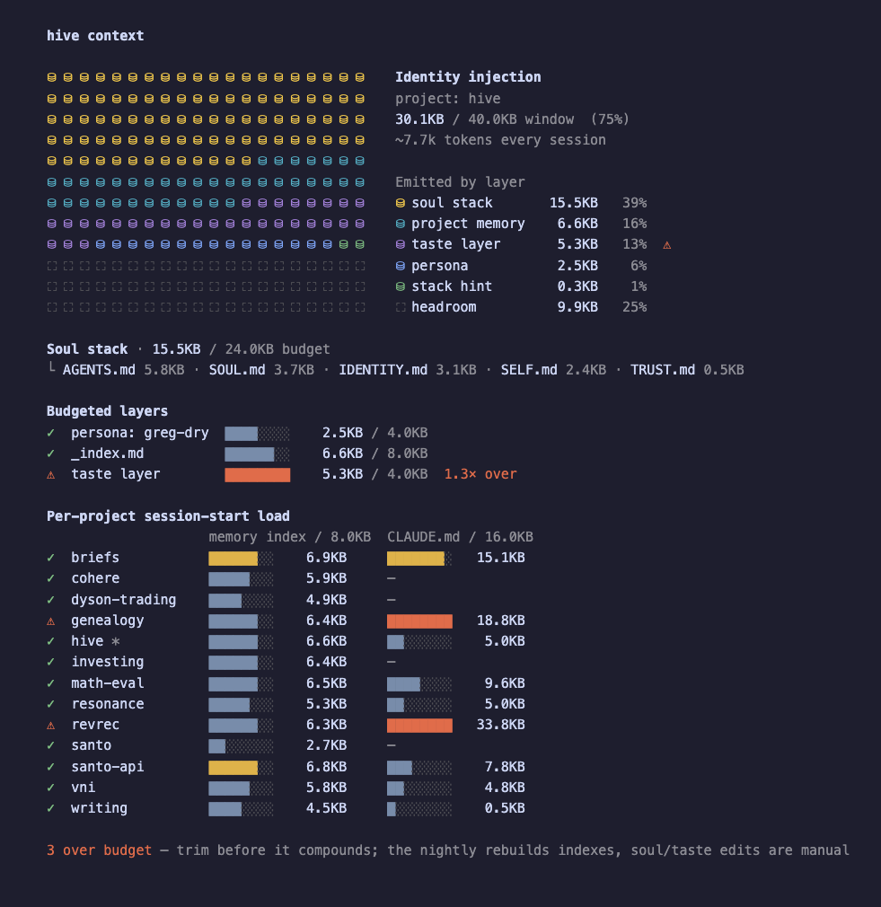

# HIVE Identity Injection

How HIVE gets its persistent identity into Claude Code, Pi, and Codex
sessions. Claude Code remains the default harness; Pi and Codex are opt-in
through `hive -3` and `hive -x`.

## The Stack

```
┌────────────────────────────────────────────────────────────────────┐
│ 1. Soul stack     ~/.hive/{SOUL,IDENTITY,SELF,AGENTS,TRUST}.md     │  always
│ 2. Project memory ~/.hive/memory/projects/<p>/_index.md            │  project-scoped sessions
│ 3. Stack hint     derived from repo markers (mix.exs → elixir)     │  per-project
│ 4. Taste          ~/.hive/taste/principles.md                      │  when present (LAST = loudest)
└────────────────────────────────────────────────────────────────────┘
```

Order is deliberate. Later content wins interpretation ties in the system
prompt, so the taste layer sits last.

Reflection discipline lives inside AGENTS.md (no longer a separate emission
block). OVERRIDES.md (the old 6th tier) was retired once Claude Code's
harness behavior settled — the only verifiably load-bearing piece, the MCP
tool pre-fetch directive that works around ToolSearch deferral, moved into
AGENTS.md.

V1 cutover (2026-04-27) collapsed the taste layer to `principles.md` only.
The previous per-domain `applications/<d>.md` + `--taste <domain>` flag were
removed; Pass V now reads the same `principles.md` during the nightly run
so taste lives at one altitude across session-time and verify-time.

## Auditing the Injection

The diagram above says what loads. `hive context` (alias `hive prompts`) says
what it costs — measured from `collectIdentityComponents`, the same code path
`hive identity emit` renders, so the audit cannot drift from the real emit:



The grid divides the 40KB window into 200 cells, one hue per layer, so the
proportions read without arithmetic. Below it, every layer with a budget of
its own gets a bar; a full bar means over budget and nothing else, so a layer
sitting at 94% still shows a gap.

Budgets live in `CONTEXT_BUDGETS` (`src/lib/context-report.ts`) and are warn
thresholds rather than hard caps — headroom above the measured baseline so
ordinary growth doesn't nag, tight enough that drift back toward pre-slim
sizes surfaces early:

| Layer | Budget | Calibrated against |
| --- | --- | --- |
| Soul stack | 24KB | ~20KB measured live after the TK-133/TK-134 slim-down |
| Persona | 4KB | a voice, not a knowledge dump |
| Project memory index | 8KB | `INDEX_SIZE_BUDGET_BYTES`, canonical in `memory.ts` |
| Taste layer | 4KB | `principles.md` targets ~500 tokens |
| A project's `CLAUDE.md` | 16KB | Claude Code loads it on top of the injection |
| Whole emit | 40KB | pre-slim ran ~63KB; post-slim baseline ~30KB |

The command exits 1 when anything is over, so it can gate CI or a pre-push
hook. `--json` emits the full report for tracking size over time; `--no-color`
(also `NO_COLOR`, or any non-TTY) drops the grid and prints a plain list.

Two of these move on their own and two don't: the nightly run rebuilds every
project's `_index.md`, so a persistent index overage means the caps need
tightening or the memory needs pruning. Soul and taste edits are manual — an
overage there stays until someone trims it.

To regenerate the image above after changing the render:

```bash
bun run scripts/render-context-screenshot.ts   # prints an HTML path
# screenshot the <pre> to img/hive-context.png
```

## Single Source of Truth

`buildCanonicalIdentity()` in `src/lib/identity.ts` is the only program that
assembles the identity prefix. All consumers route through it:

| Consumer | How it gets the prefix |
| ------------------- | ------------------------------------------------------------ |
| Claude Code direct session | `~/.claude/hooks/load-identity.sh` -> `hive identity emit` |
| Claude Code via `hive` | temp `--append-system-prompt-file` -> `assembleIdentity()` |
| Pi via `hive -3` | generated `pi -e <tempfile>` extension -> `assembleIdentity()` |
| Codex via `hive -x` | `~/.codex/AGENTS.md`, refreshed before launch and by `~/.hive/codex-load-identity.sh` -> `hive identity emit` |
| Watch Act branch executor | `--append-system-prompt-file` -> `assembleIdentity()` |

The Claude Code SessionStart hook and Codex's direct-session hook are thin
shell wrappers that delegate to `hive identity emit`. Pi gets a runtime-generated extension
because its launch API supports prompt mutation directly. Drift is
structurally limited: there is only one program that builds the prefix.

## Wiring

### Claude Code

The canonical user-level hook is at `~/.claude/hooks/load-identity.sh`.
It's wired in `~/.claude/settings.json`:

```json
{
  "hooks": {
    "SessionStart": [{ "hooks": [{ "type": "command", "command": "~/.claude/hooks/load-identity.sh" }] }],
    "PostCompact":  [{ "hooks": [{ "type": "command", "command": "~/.claude/hooks/load-identity.sh" }] }]
  }
}
```

`hive init` installs and wires both. `hive doctor` verifies wiring AND
that the live hook hasn't drifted from `templates/hooks/load-identity.sh`.

If the doctor flags drift, run `hive init --force-hook` to restore the
canonical wrapper. (User customization belongs in `~/.hive/*.md` files,
not in the hook.)

### Pi

`hive -3` and `hive --pi` route an interactive session through Pi. HIVE
generates a temporary TypeScript extension that embeds the canonical
identity prefix and prepends it in Pi's `before_agent_start` hook:

```bash
pi -e /tmp/hive-pi-ext-*/identity.ts [...args]
```

All user args after `-3` pass through unchanged. Pi owns provider and model
selection through its normal flags/config.

`hive init` registers HIVE MCP in `~/.pi/agent/mcp.json` when Pi is
installed. That config is consumed by `pi-mcp-adapter`; install/register the
adapter on the Pi side if MCP tools do not appear.

Scratch setup for a new machine:

1. Install and initialize Pi.
2. Install Pi's MCP bridge:

   ```bash
   pi install npm:pi-mcp-adapter
   ```

3. Install HIVE from this repo (`./install.sh`), then run:

   ```bash
   hive init
   ```

4. Verify wiring:

   ```bash
   hive doctor --verbose
   ```

5. Launch through Pi:

   ```bash
   hive -3
   ```

There is no static template for `~/.pi/agent/mcp.json` because the HIVE MCP
command path is machine-specific. `hive init` writes the local path while
preserving any existing Pi MCP servers. Inside Pi, adapter-exposed tools are
prefixed; use names like `hive_hive_status` rather than bare
`hive_status`.

Pi is an opt-in research lane while the subscription-OAuth policy question
remains open. Claude Code stays the default.

### Codex

Codex uses native files under `~/.codex/`:

| File | Purpose |
| ---- | ------- |
| `~/.codex/AGENTS.md` | Persistent identity prefix Codex auto-loads |
| `~/.codex/config.toml` | `[mcp_servers.hive]` registration |
| `~/.codex/hooks.json` | SessionStart hook registration |
| `~/.hive/codex-load-identity.sh` | Hook script that refreshes `AGENTS.md` from `hive identity emit` |

`hive init` wires these when Codex is installed and `~/.codex/` exists.
`hive -x` and `hive --codex` refresh AGENTS.md from the current cwd before
spawning Codex, then route the interactive session through Codex;
`HIVE_HARNESS=codex hive` makes that the default for interactive launches.
Use `--claude` or `--claude-code` to override the env var.
`hive doctor` reports Codex issues as warnings because Codex is optional, and
it checks whether AGENTS.md matches the current HIVE identity rather than only
checking that the file exists.

## Adding a New Identity Section

The full add-checklist when introducing a new section to the prefix:

1. If it's a new file path, add it to `HivePaths` in `src/lib/paths.ts`
2. If it's part of the soul stack, add the filename to `IDENTITY_FILES`
   in `src/lib/identity.ts`. Otherwise extend `buildCanonicalIdentity()`
   with a new emission block in the right ordering position.
3. Create the template at `templates/<name>.md`
4. Add a `writeIfMissing(paths.X, "<name>.md")` call in `src/commands/init.ts`
5. Extend `checkIdentity()` in `src/commands/doctor.ts` with a presence check
6. Update `src/__tests__/identity.test.ts`:
   - Seed the new file in the fixture
   - Add a marker assertion in the "emits all four sections" test
   - Adjust the canonical ordering list
7. Update the stack diagram in this file

The shell hooks do NOT need updating — they delegate to `hive identity
emit`, which calls `assembleIdentity()`, which calls
`buildCanonicalIdentity()`. The hooks are generic plumbing.

## Drift Detection

Two tests guard against the drift that motivated this consolidation:

- `hook ↔ assembleIdentity parity` — runs the template hook in a fixture
  HIVE_HOME and asserts byte-equality with `assembleIdentity()`. If the
  hook stops being a pure delegator (e.g. someone adds shell logic), this
  fails.
- `live ~/.claude/hooks/load-identity.sh matches the template` — verifies
  that the installed hook hasn't been hand-edited away from the canonical
  template. Mirrored by `hive doctor`.

Together they enforce: shell hook == TypeScript code path == installed file.

## Debugging "Maya Feels Cold"

Run `hive doctor`. Look for FAILs and WARNs in the Identity group. If
everything is green and Maya still feels off:

1. **Verify you're in a fresh session.** Identity loads at SessionStart
   (and PostCompact). Old sessions won't pick up changes until restart.
2. **Check the model.** `claude --version` should show ≥ 2.1.x. Interactive
   sessions use whatever `--model` / `~/.claude/settings.json` specifies.
   Watch Act defaults to `claude-opus-4-6`; override it with
   `HIVE_WATCH_ACT_MODEL`.
3. **Dry-run the hook.** `bash ~/.claude/hooks/load-identity.sh | less` —
   should show soul stack → project memory → stack hint → taste.
4. **Dry-run the command directly.** `hive identity emit | less` — same
   output as the hook. If they differ, the hook drifted (run
   `hive init --force-hook`).
5. **Inspect what actually loaded.** In Claude Code, the SessionStart hook
   output appears in the system prompt. If your session shows the base
   prompt but not the HIVE stack, the hook didn't fire. Check settings.json
   wiring. In Pi, launch with `hive -3` and verify the generated extension
   loaded before the model starts. In Codex, inspect `~/.codex/AGENTS.md`;
   if it is stale, run `hive -x` from the target project or `hive init`, then
   check `~/.codex/hooks.json`.

## Related

- `docs/hive-reach.md` — reach matrix across runtimes (identity is one row)
- Tickets TK-047 through TK-053 (the identity-reconsolidation epic)
- `docs/memory-architecture.md` — how project memory works
